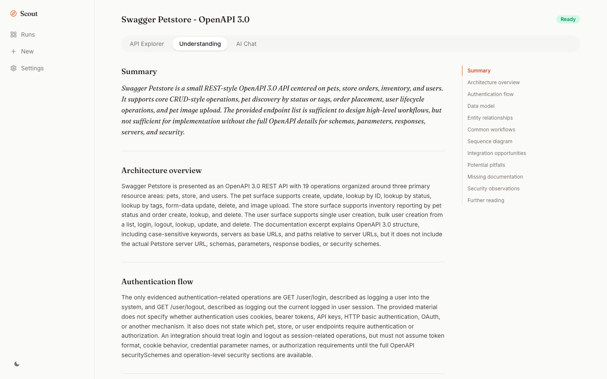
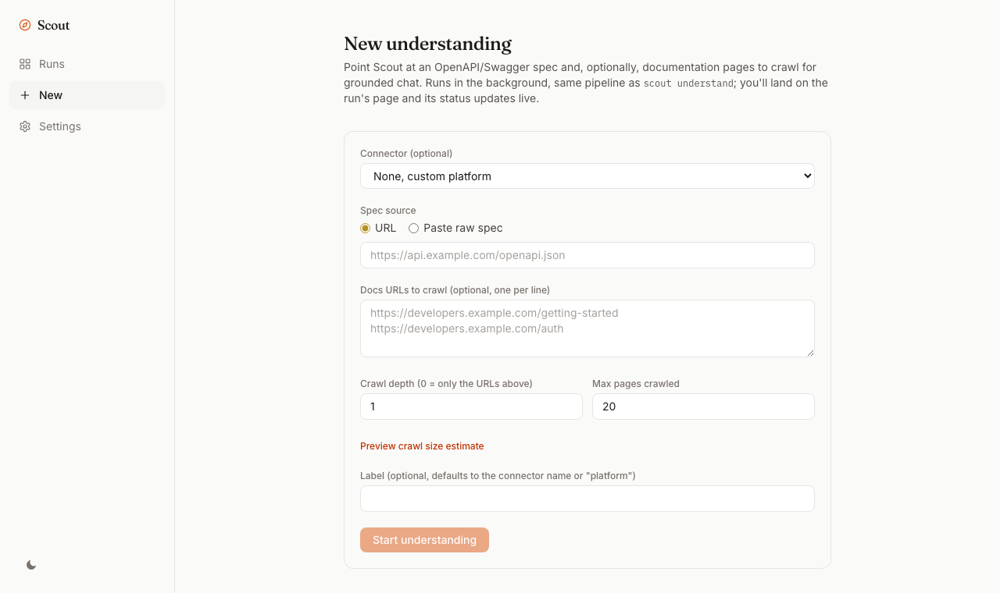
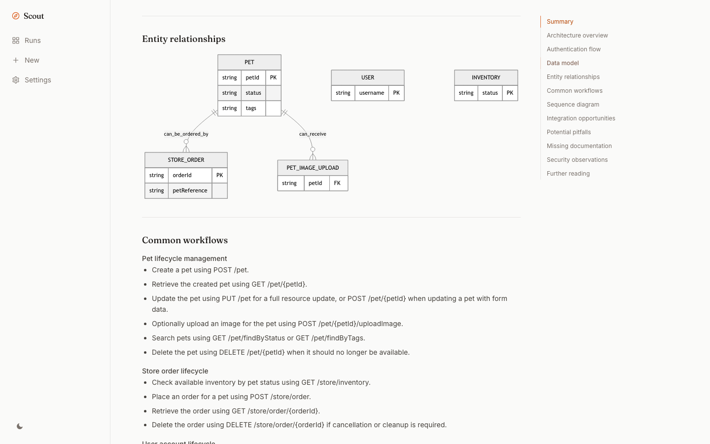
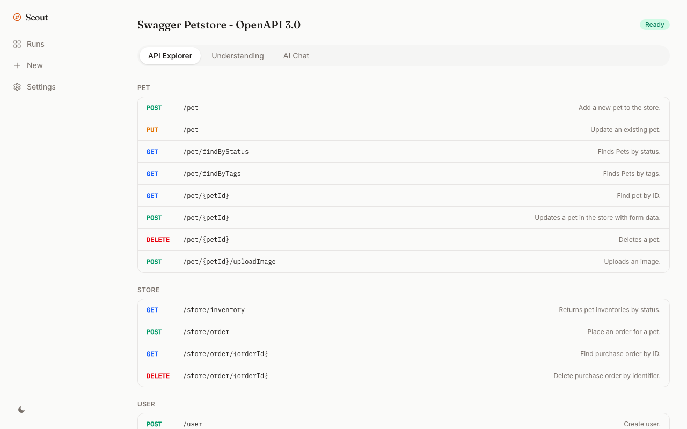
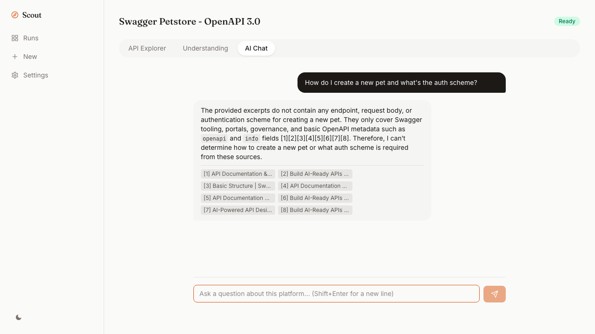

# Scout

[](https://github.com/prabhuavula7/scout/actions/workflows/ci.yml)
[](LICENSE)

**Understand any enterprise platform in minutes.**

Point Scout at a platform's OpenAPI/Swagger spec and its docs, and it produces a cited integration blueprint (architecture, auth flow, data model, common workflows, pitfalls) plus a grounded chat assistant, all running locally on your machine. No account, no server, no hosting.

```
npm install -g scoutcli   # once published; see "Local development" until then

scout understand https://petstore3.swagger.io/api/v3/openapi.json --docs https://example.com/docs
scout chat petstore-openapi-3-0
scout serve
```

Don't want Node/npm on your machine at all? See "Run with Docker" below, one `docker compose up` and you're at the web UI.



## What this is

A CLI (`scout`) and a small local web app (`scout serve`) built on the same core: an agent pipeline that imports an OpenAPI/Swagger spec, crawls the docs you point it at, chunks and embeds them, and asks an LLM to synthesize a grounded, citation-backed understanding of the platform, not a guess from the model's training data. Everything is stored under `~/.scout/runs/`, so a run from a month ago and one from five minutes ago show up identically. The web app isn't just a viewer: its "New" tab runs the same pipeline as `scout understand`, so someone who'd rather not touch a terminal at all can install once, run `scout serve`, and do everything (start a run, watch its status live, chat, find related resources, configure providers) from the browser.

## Why it exists

Every integration engineer has opened an unfamiliar platform's docs and spent the first hour just building a mental model: what's the auth flow, what are the core entities, what breaks in practice. Scout automates that first hour. It's the tool a Forward Deployed Engineer, a solutions architect, or anyone shipping a new integration would reach for before writing the first line of code.

## Who it's for

Engineers who integrate with third-party platforms regularly, not just once. It's designed to be run repeatedly: `scout watch` keeps a platform's understanding current as its docs change, and every run is kept, so you can come back to a platform you looked at last quarter and see what changed.

## Why OpenAPI/Swagger instead of just a URL

A bare docs URL is prose; an OpenAPI spec is a machine-readable contract, endpoints, parameters, schemas, auth scheme, all structured. Scout uses the spec as ground truth for what the API can actually do, and the crawled docs as ground truth for how it's meant to be used, prose and endpoint contract cross-checked against each other rather than trusting either alone. That's also why the Understanding Agent is instructed to say "missing documentation" instead of inventing an endpoint or field that isn't evidenced in what was actually provided.

The same honesty extends to Scout's own limits, not just the platform's: synthesis is capped (300 endpoints, 100 doc chunks per run, to bound prompt size and cost) so a run's page discloses it via a warning banner whenever a cap was actually hit, rather than quietly looking like a complete blueprint for a platform far larger than what was actually analyzed. A doc page that comes back suspiciously thin (commonly a JS-rendered page a static crawl can't execute) gets the same treatment.

## Real-world use cases

- Evaluating a new vendor's API before a build/buy decision.
- Onboarding onto a platform your team just adopted, without reading the entire docs site cover to cover.
- Keeping a living understanding of a platform your team integrates with, refreshed automatically as its docs change (`scout watch`).
- Feeding a coding agent (Claude Code, Codex, Gemini CLI) real, cited platform knowledge mid-session via `scout mcp`, instead of it guessing from training data.

## Screenshots

<table>
<tr>
<td width="50%">

**Runs**, the landing page


</td>
<td width="50%">

**New**, start an understanding without touching the CLI



</td>
</tr>
<tr>
<td width="50%">

**Understanding**, entity relationships as a Mermaid diagram



</td>
<td width="50%">

**API Explorer**, every endpoint the spec declares



</td>
</tr>
<tr>
<td width="50%">

**AI Chat**, grounded and cited, refuses to guess



</td>
<td width="50%">

**Settings**, provider keys (never displayed once saved)


</td>
</tr>
</table>

## Core commands

| Command | What it does |
|---|---|
| `scout understand <spec-url-or-path>` | Run the full pipeline: import spec, crawl `--docs`, generate the understanding. Prints a size/token estimate first; `--docs-depth <n>` (default 1) follows same-site links that many hops past each `--docs` URL, `--docs-max-pages <n>` (default 20) caps the total regardless of depth. |
| `scout list` | List every run, most recently updated first. |
| `scout rm <slug>` | Delete a run and everything under it. Prompts for confirmation unless `-y`/`--yes` is passed. |
| `scout chat <slug>` | Terminal chat REPL, grounded in the crawled docs, with citations. |
| `scout export <slug> --format md\|json` | Export the understanding (and any research results) as Markdown or JSON. |
| `scout watch <slug>` | Poll the run's doc URLs, re-run the pipeline automatically when they change. |
| `scout research <slug>` | Find related articles, tutorials, and use cases via a configured search provider (Tavily, SerpApi). |
| `scout serve` | Start the local web viewer. Binds `127.0.0.1` only by default (no login, not reachable from outside the machine); `--host 0.0.0.0` opens it up, e.g. running inside Docker. |
| `scout connectors list` / `add <file>` | List or add connector presets (see "Adding a connector" below). |
| `scout config llm add <kind> --api-key <key>` | Add an LLM provider (openai, anthropic, azure-openai, openrouter, openai-compatible). See "Configuring providers" below. |
| `scout config llm list` / `remove <id>` / `enable <id>` / `disable <id>` | List, remove, or toggle a configured LLM provider without deleting it. |
| `scout config search add <kind> --api-key <key>` | Add a web search provider (tavily, serpapi), used by `scout research`. |
| `scout config search list` / `remove <id>` / `enable <id>` / `disable <id>` | List, remove, or toggle a configured search provider. |
| `scout config set <key> <value>` / `get` | Legacy single-key shorthand (`openai-api-key`, `openai-chat-model`, `openai-embedding-model`, `tavily-api-key`), kept working for existing scripts. |
| `scout mcp` | Run Scout as an MCP server (stdio) for Claude Code, Codex, Gemini CLI, etc. |

## Configuring providers

Scout works with any LLM and any web search provider, not just OpenAI and Tavily, and you can configure more than one for either role:

```
scout config llm add openai --api-key sk-... --roles chat,embedding
scout config llm add anthropic --api-key sk-ant-... --roles chat --priority 1
scout config search add tavily --api-key tvly-...
```

`--roles` controls what an entry is used for: `chat` (completions) and/or `embedding` (Anthropic has no embeddings API, so an Anthropic entry only ever carries `chat`; pair it with an OpenAI/Azure/compatible entry for `embedding`). When more than one entry shares a role, `--priority` (lower first) orders a fallback chain: if the first provider's call fails, Scout automatically retries with the next one. `openai-compatible` covers OpenRouter, Ollama, LM Studio, vLLM, or any other backend that speaks the OpenAI chat-completions wire protocol at a custom `--base-url`, so local/open-source models work the same way. `scout config llm list` / `scout config search list` show what's configured (keys are never printed back); `remove <id>` deletes an entry.

Everything above is also available as a Settings tab in `scout serve`'s local web viewer, for anyone who'd rather not touch the terminal. Both read and write the same `~/.scout/config.json`, so a key added in one shows up in the other.

If nothing is configured at all, Scout falls back to `OPENAI_API_KEY` / `TAVILY_API_KEY` environment variables, so the zero-setup `.env` workflow still works without ever touching `scout config`.

## Using `scout mcp` with a coding agent

`scout mcp` is a standard stdio MCP server (built on `@modelcontextprotocol/sdk`), exposing `understand_platform`, `ask_platform`, and `list_platforms`. Any MCP client that supports stdio servers can use it; setup is the same `command`/`args` shape everywhere, just in a different config file:

**Claude Code**
```
claude mcp add scout -- scout mcp
```
or in a project's `.mcp.json`:
```json
{ "mcpServers": { "scout": { "command": "scout", "args": ["mcp"] } } }
```

**Claude Desktop** (`claude_desktop_config.json`)
```json
{ "mcpServers": { "scout": { "command": "scout", "args": ["mcp"] } } }
```

**Cursor** (`.cursor/mcp.json`, project or global)
```json
{ "mcpServers": { "scout": { "command": "scout", "args": ["mcp"] } } }
```

**Codex CLI** (`~/.codex/config.toml`)
```toml
[mcp_servers.scout]
command = "scout"
args = ["mcp"]
```

If you're running from source instead of a global install, swap `"scout"` for `"node"` and add the CLI's built entry point as the first arg, e.g. `"args": ["/path/to/scout/packages/cli/dist/index.js", "mcp"]`.

## Architecture

```
packages/agents       import / documentation / understanding / chat / research agents, provider-agnostic search
packages/ai           provider-agnostic LLM interface (OpenAI, Anthropic, Azure OpenAI, OpenRouter, OpenAI-compatible)
packages/rag          chunking + citation formatting
packages/store        AgentStore contract + LocalFileStore (the CLI's default persistence), shared provider config
packages/connectors    connector presets as JSON (bundled + user-added)
packages/cli           the `scout` binary
apps/web               the local web app (Next.js), served by `scout serve`: a sidebar (Runs / New / Settings), a "New" tab to start an understand run without the CLI, and a Settings tab for provider keys
```

The agent pipeline (`packages/agents`) doesn't know or care where its data is persisted; it depends on an `AgentStore` interface. `LocalFileStore` (in `packages/store`) is the default implementation: one directory per run under `~/.scout/runs/<slug>/`, flat JSON files for the current snapshot, append-only JSONL for chat and audit logs, and a `history/` folder of prior understanding snapshots whenever `scout watch` detects a doc change. Hybrid search (embedding cosine similarity blended with keyword relevance) runs in-memory, no database required.

`apps/api` and `apps/workers` (Fastify + Clerk auth + Postgres/pgvector + BullMQ/Redis) implement the same `AgentStore` contract over Postgres. They're kept in the repo, working, but dormant: not part of the default build/dev/test pipeline, for anyone who wants a hosted multi-user mode later. See `apps/api/README.md`.

## Adding a connector

A connector is a JSON file, not code:

```json
{
  "slug": "acme",
  "name": "Acme",
  "category": "crm",
  "implemented": true,
  "suggestedDocsUrl": "https://developers.acme.com/",
  "defaultAuthScheme": "bearer_token",
  "description": "Acme's CRM API."
}
```

Bundled connectors live in `packages/connectors/registry/*.json`; `scout connectors add <file>` drops your own into `~/.scout/connectors/`, which overrides a bundled one by slug or adds a new one. `implemented: true` means someone has actually run `scout understand` against it successfully, since the import path itself is generic (any valid OpenAPI/Swagger spec works regardless of connector). See `CONTRIBUTING.md` for the full recipe if you want to contribute one upstream.

## Run with Docker

For anyone who'd rather not install Node/pnpm at all:

```
git clone https://github.com/prabhuavula7/scout.git
cd scout
docker compose up
```

Open `http://localhost:4207` and you're at the same web app `scout serve` gives a native install, including the "New" tab, Settings tab, and chat. Runs and provider config persist in a named Docker volume (`scout-data`, mounted at `/data` inside the container) across restarts and rebuilds.

Skip the Settings tab entirely by setting keys as env vars before starting:

```
OPENAI_API_KEY=sk-... TAVILY_API_KEY=tvly-... docker compose up
```

(or put them in a `.env` file next to `docker-compose.yml`; compose reads it automatically). Everything else about provider configuration in the README above applies the same way once the container has your keys.

CLI commands (`understand`, `chat`, `rm`, etc.) work the same way through the running container, since the web app and CLI both read the same `/data` volume:

```
docker compose exec scout scout understand https://petstore3.swagger.io/api/v3/openapi.json --docs https://example.com/docs
docker compose exec scout scout list
```

`docker compose up --build` after pulling new commits rebuilds the image from source; there's no published image on Docker Hub/GHCR yet, `build: .` in `docker-compose.yml` always builds locally.

## Local development

```
pnpm install
pnpm build           # builds everything except the dormant hosted mode
pnpm --filter scoutcli dev -- understand <spec-url>   # run the CLI from source via tsx
pnpm --filter scoutcli build && node packages/cli/dist/index.js serve
```

`pnpm typecheck` / `pnpm lint` / `pnpm test` cover the default (CLI + viewer) path, including `apps/web`'s own test suite (API route handlers + interactive components, via Vitest + React Testing Library); `pnpm hosted:build` / `pnpm hosted:dev` cover the dormant hosted mode.

See [CHANGELOG.md](CHANGELOG.md) for release notes and [ROADMAP.md](ROADMAP.md) for what's done vs. still open.

## License

MIT, see [LICENSE](LICENSE).
