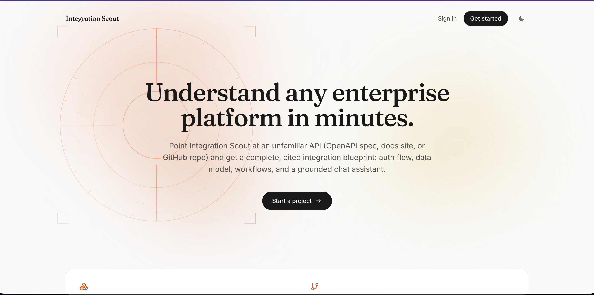
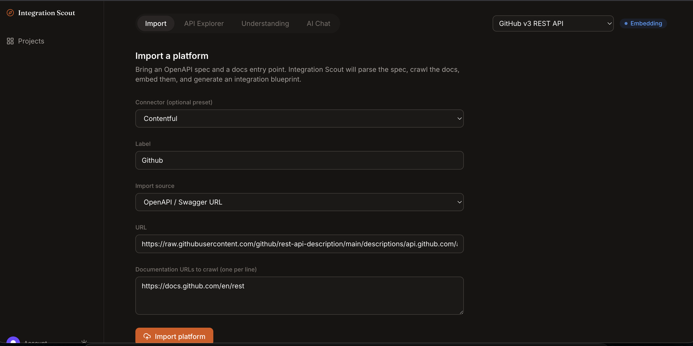
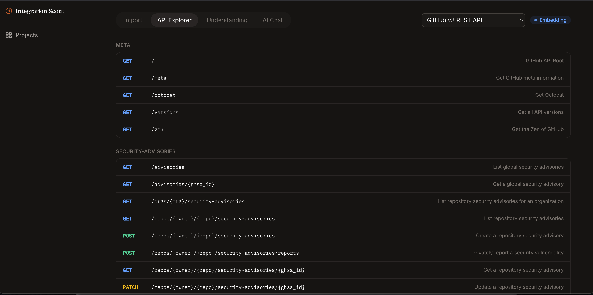
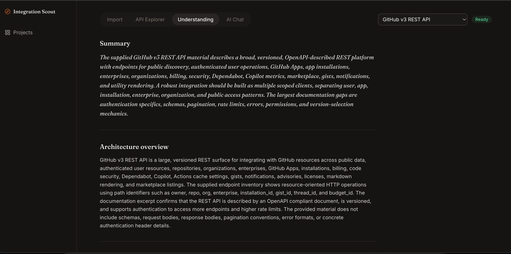
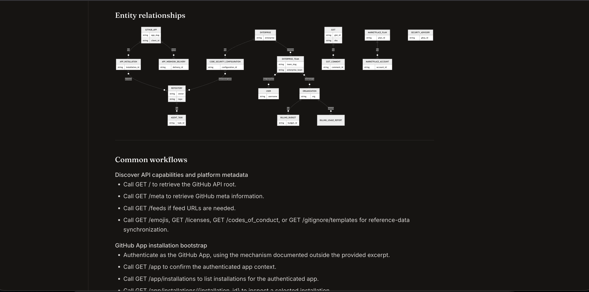
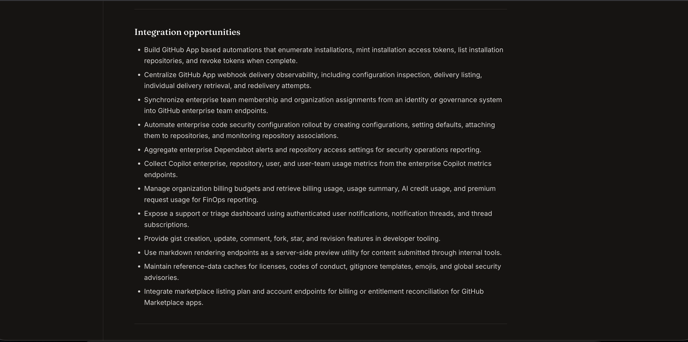
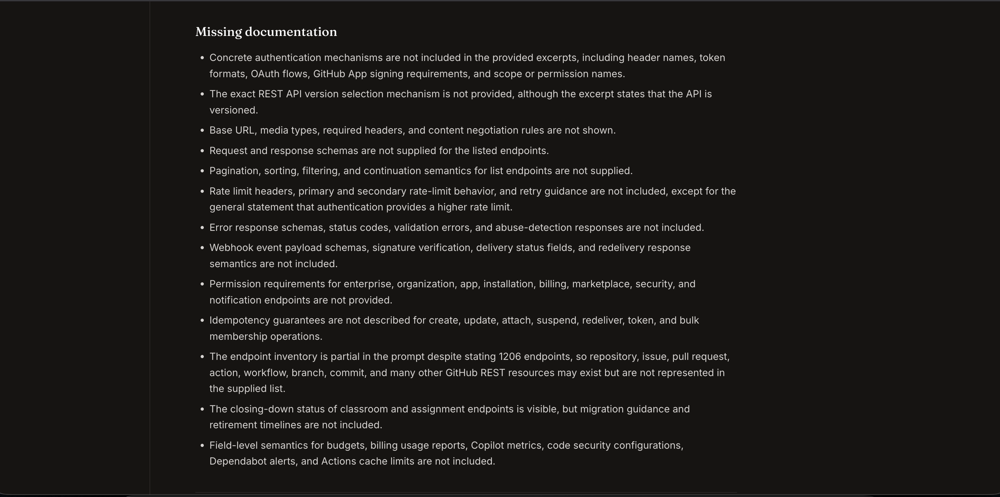
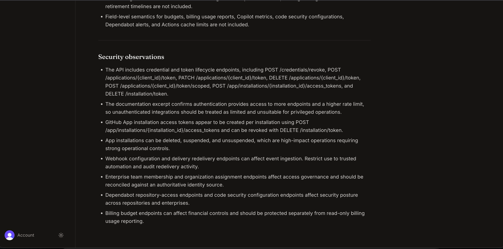
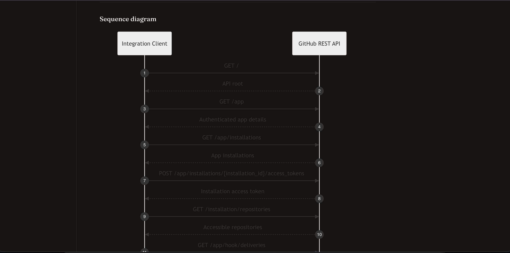
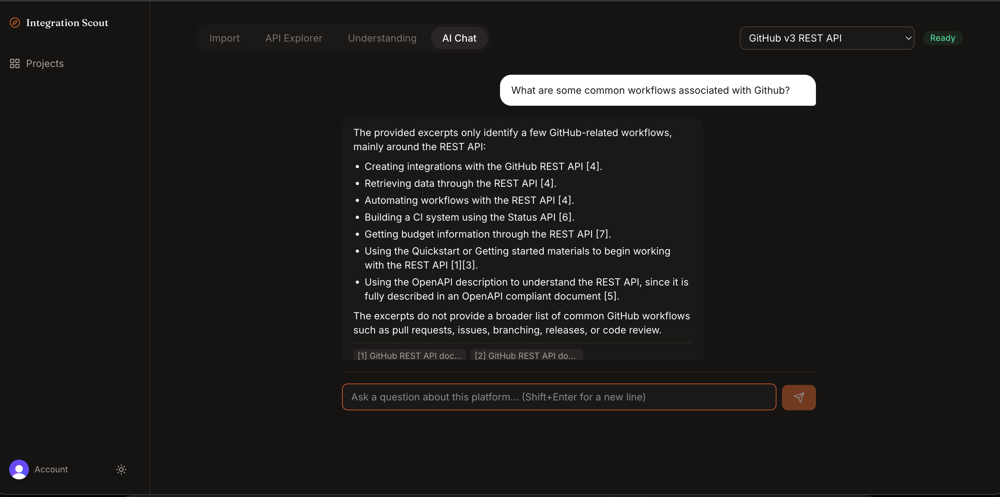

# Integration Scout

**Understand any enterprise platform in minutes.**

[](https://github.com/prabhuavula7/IntegrationScout/actions/workflows/ci.yml)
[](./LICENSE)



## What this is

Integration Scout is an AI-native tool that takes an unfamiliar enterprise
platform (an OpenAPI/Swagger spec plus its documentation) and produces, in
minutes, what normally takes an engineer days of manual reading: a
structured, cited integration blueprint. Architecture overview, auth flow,
data model, entity relationships, common workflows, pitfalls, security
observations, and a grounded chat assistant that answers follow-up questions
without inventing anything it wasn't given.

The pipeline is a set of cooperating agents, not one giant prompt:

```
Coordinator
  |- Import Agent          parses OpenAPI/Swagger into Platform + Endpoint[]
  |- Documentation Agent   crawls docs URLs into markdown, chunks, embeddings
  |- Understanding Agent   synthesizes the blueprint from endpoints + doc chunks
Chat Agent runs independently per message: embed query, hybrid search
(pgvector cosine + Postgres full-text), grounded completion with citations.
```

Every agent run is persisted to an audit table (status, input, output, error,
attempt), so the pipeline is inspectable, not a black box.

## Why it exists

Engineers who do integration work over and over, not once, spend a large
share of their time just getting oriented in a platform they've never touched
before: reading docs, guessing at auth, mapping out the data model by trial
and error. Integration Scout compresses that ramp-up into a few minutes so
the actual integration work can start sooner.

## Who it's for

Forward-deployed, solutions, and integration engineers who get handed a new
customer's tech stack (a CMS, a DAM, a CRM, a workflow tool) and need to
understand it well enough to build against it, usually under time pressure
and usually without a warm intro from that vendor's engineering team. Also
useful for anyone doing technical due diligence on a platform before
committing engineering time to it.

## Why OpenAPI/Swagger instead of just a URL

This is the most deliberate design decision in the system. A docs URL is
prose. Hand an LLM only prose and ask "what endpoints does this API have,"
and it will confidently invent plausible-sounding ones that don't exist:
wrong parameter names, wrong required fields, wrong auth schemes.

OpenAPI/Swagger is the platform's actual machine-readable contract: real
paths, methods, parameter types, request/response schemas, security schemes.
The **Import Agent parses that deterministically**, no LLM involved, just a
real parser, so every endpoint in the API Explorer is guaranteed real, not
inferred. The docs URL is the second input, used for a different job: it
supplies the human context a spec file doesn't have (rate limits, gotchas,
recommended workflows). The Understanding Agent then reasons over both:
structural ground truth from the spec, semantic context from the docs. That
split is what lets it cite real endpoints and explain real nuance without
fabricating either.

It also matches reality: most real platforms worth integrating with
(Contentful, GitHub, Stripe, HubSpot, Salesforce) publish an OpenAPI or
Swagger spec. Scraping endpoint definitions out of arbitrary docs-site HTML
instead would be far more fragile since every vendor structures their docs
site differently, while OpenAPI is a standard.

## Real-world use cases

- **New customer onboarding.** An engineer gets assigned a customer running
  an unfamiliar CMS. Instead of a day reading docs, they import it and get an
  instant, cited architecture and auth briefing.
- **Pre-integration planning.** Map out the data model and entity
  relationships before writing connector code, so the integration is
  architected correctly the first time instead of discovered mid-build.
- **Vendor evaluation.** Quickly assess a platform's auth complexity,
  pagination model, and rate limits before committing to integrate with it.
- **Knowledge handoff.** Point the next engineer at a platform's blueprint
  instead of relying on tribal knowledge.
- **Live Q&A while building.** Ask "how does pagination work here again?"
  mid-integration and get an answer grounded in the actual crawled docs, with
  a clickable citation to verify it.

This repo implements two connectors (**Contentful** and **Bynder**)
end-to-end as first-class presets. See [ROADMAP.md](./ROADMAP.md) for what's
deliberately not built yet.

## Architecture

```
apps/
  web/         Next.js 15 App Router: workspace UI, Clerk auth
  api/         Fastify: REST API, Zod validation, Clerk token verification
  workers/     BullMQ worker: runs the import pipeline in the background
packages/
  types/       Shared Zod schemas (single source of truth for every shape)
  db/          Drizzle ORM schema (Postgres + pgvector), hybrid search
  ai/          Provider-agnostic LLM interface (OpenAI implementation)
  rag/         Chunking, embedding, citation formatting
  agents/      Import / Documentation / Understanding / Chat / Coordinator
  connectors/  Registry of target enterprise platforms
  ui/          Cross-cutting React primitives (StatusBadge, EmptyState, ThemeToggle)
  config/      Shared tsconfig + eslint config
```

## Tech stack and why

**Turborepo monorepo, TypeScript everywhere.** One repo, one lint/typecheck/
test pipeline, and a shared `packages/types` package that's the single
source of truth for every shape (API requests, database rows, LLM
structured output). Backend and frontend can never quietly drift apart on
what a `Platform` or a `ChatMessage` looks like, since they import the exact
same Zod schema.

**Next.js 15 App Router (`apps/web`).** Server components handle
auth-gated data fetching and redirects (checking `auth()` before rendering
the dashboard, for example) without a client-side loading flash. File-based
routing maps cleanly onto the workspace's tabs (Import, API Explorer,
Understanding, AI Chat). Deploys to Vercel with no extra configuration.

**Fastify (`apps/api`).** Faster and lighter than Express, with first-class
TypeScript support and a plugin architecture that made the Clerk
authentication middleware a clean, isolated `fastify-plugin` rather than
something threaded through every route by hand.

**Zod, used three ways.** The same schema in `packages/types` validates
incoming API requests, defines the Drizzle-adjacent TypeScript types, and
constrains the LLM's structured output (`completeStructured` passes the Zod
schema straight to OpenAI's API, so the model's response is parsed and
validated in one step instead of prompted for JSON and hoped for).

**Postgres with pgvector, via Drizzle ORM (`packages/db`).** Embeddings live
in the same database as the relational data (platforms, endpoints, chat
history) instead of standing up a separate vector database. Hybrid search
blends pgvector cosine similarity with Postgres full-text search in one SQL
query, because pure vector search alone misses exact keyword matches like
error codes or field names that a user might search for verbatim. Drizzle
was chosen over a heavier ORM because the schema stays plain SQL-shaped
TypeScript, not a layer of abstraction to fight when writing that hybrid
query by hand.

**Redis and BullMQ, in a dedicated `apps/workers` process.** Importing a
platform (parse spec, crawl docs, embed, generate the blueprint) can take
longer than an HTTP request should block for, so it runs as a background
job. The API returns immediately after enqueueing, and the frontend polls
platform status (`pending` to `importing` to `crawling_docs` to `embedding`
to `ready`) so progress is visible instead of a spinner with no meaning.

**Clerk for auth**, with an explicit, logged fallback to a single dev user
when `CLERK_SECRET_KEY` is unset, so the app is runnable end-to-end on a
fresh clone before anyone has configured real auth.

**A provider-agnostic LLM interface (`packages/ai`), OpenAI as the current
implementation.** Every agent depends on an `LLMProvider` interface
(`complete`, `completeStructured`, `streamComplete`, `embed`), never the
OpenAI SDK directly. Adding Claude, Gemini, or OpenRouter later is one new
adapter file and an `AI_PROVIDER` env value, not a rewrite of the agents.

**An agent framework with a real audit trail (`packages/agents`).** Every
agent run (Import, Documentation, Understanding, Chat) goes through
`withRetry` (exponential backoff, since docs sites and LLM APIs fail
transiently far more often than local code) and is persisted to an
`agent_runs` table with status, input, output, error, and attempt count.
The pipeline is inspectable after the fact instead of a black box.

**TanStack Query and Zustand on the frontend, kept deliberately separate.**
Server state (projects, platforms, understanding, chat messages) is React
Query, including polling while an import is in progress. The one piece of
pure client state, which platform is selected per project, is a small
Zustand store. Mixing the two would blur what's a cache of server data
versus what's local UI state.

**Tailwind v4 with CSS-based theme configuration.** Design tokens (fonts,
the accent color, animation keyframes) live in one `@theme` block in
`globals.css` rather than a separate `tailwind.config.js`, and dark mode is
class-based (`@custom-variant dark`) rather than tied only to OS preference,
so the theme toggle can override it and persist the choice.

**Mermaid for diagrams.** The Understanding Agent generates diagrams as
Mermaid text, part of its structured Zod output, rendered client-side. The
diagram is auditable, diffable text, not an opaque generated image.

**Vitest for the test suite.** Chosen specifically because it covers pure
logic (chunking, citation building, OpenAPI parsing, code generation)
without needing a live Postgres or Redis instance, so `pnpm test` works with
zero infrastructure running.

**Docker Compose, not Kubernetes, for local infrastructure.** This project
stands up exactly two stateful local services (Postgres, Redis). Compose is
the right-sized tool for that; Kubernetes would be solving a
production-orchestration problem this repo doesn't have.

## Walkthrough: importing a platform

The screenshots below are from a real run against GitHub's public REST API
(a large, genuinely public OpenAPI spec, imported by URL rather than pasted
directly, to exercise the fetch-and-parse path rather than a raw paste).

### 1. Start an import

Pick a connector preset (or leave it and fill in your own label), choose an
import source, and supply a spec plus a documentation URL to crawl.



Two supported import sources:

- **OpenAPI / Swagger URL**: point at a real, publicly hosted spec. For
  example, GitHub's official spec lives in their own
  `github/rest-api-description` repository on GitHub and is fetched directly
  by URL.
- **Raw OpenAPI JSON or YAML**: paste a spec directly when there's no public
  URL to fetch (a partial spec reconstructed from prose docs, or one
  obtained under NDA from a vendor's support team).

While the import runs, the platform status badge cycles through pending,
importing, crawling docs, embedding, and finally ready, so progress is
visible rather than a spinner with no meaning.

### 2. Browse the parsed API

Every endpoint below comes directly from the parsed spec: real methods,
paths, and summaries, grouped by tag, with generated cURL/TypeScript/Python
code samples per endpoint.



### 3. Read the generated understanding

The Understanding Agent synthesizes a full blueprint from the parsed
endpoints plus whatever was crawled from the docs URL. It starts with a
summary and architecture overview.



It includes a generated entity relationship diagram and a breakdown of
common workflows, both derived from the actual endpoint set, not invented.



It also proposes concrete integration opportunities based on what the API
can actually do.



Where the provided material doesn't cover something (auth header formats,
pagination semantics, rate limit behavior), the agent says so explicitly in
a **Missing documentation** section rather than guessing.



It closes with security observations: which endpoints are high-impact,
which need strong operational controls, and where authentication actually
matters.



A generated sequence diagram shows a realistic multi-step flow through the
API (in this case, a GitHub App bootstrapping an installation access token
and listing accessible repositories).



### 4. Ask the grounded chat assistant

Every answer is retrieved via hybrid search (pgvector cosine similarity
blended with Postgres full-text search) over the same chunks the
Understanding Agent used, and every answer must cite its sources inline.



## Tutorial: two real end-to-end examples

Both of these are real runs, not fixtures. Bring your own OpenAI API key.

### Example A: Contentful, via a hand-authored raw spec

Useful when there's no single public spec URL to point at, or to test the
`openapi_raw` import path.

1. Connector preset: `Contentful` (auto-fills the label and a real docs URL).
2. Import source: `Raw OpenAPI JSON or YAML`.
3. Paste a small spec covering real, documented Contentful Content Delivery
   API endpoints (entries, assets, content types), with a `bearerAuth`
   security scheme.
4. Docs URL: leave the pre-filled `https://www.contentful.com/developers/docs/`.
5. Submit, watch the status reach ready, then check API Explorer,
   Understanding, and AI Chat.

### Example B: GitHub's REST API, via a real public spec URL

Useful for testing the `openapi_url` fetch-and-parse path against a large,
real, actively maintained spec.

1. Connector preset: any (GitHub isn't a built-in preset yet, so just
   overwrite the label).
2. Import source: `OpenAPI / Swagger URL`.
3. URL: `https://raw.githubusercontent.com/github/rest-api-description/main/descriptions/api.github.com/api.github.com.json`
4. Label: `GitHub`.
5. Docs URL: `https://docs.github.com/en/rest`.
6. Submit. This spec is large (thousands of endpoints), so import takes
   noticeably longer than a small hand-authored one, but the Understanding
   Agent only ever looks at the first 150 endpoint summaries and 40 doc
   excerpts regardless of total size, so the LLM call itself stays bounded.

### Where to find a real spec for any other platform

1. Check the platform's own developer docs for an "OpenAPI spec," "Swagger,"
   or "API Reference" link, often in the docs footer or sidebar.
2. Try common conventions directly: `https://api.example.com/openapi.json`,
   `/swagger.json`, or a `developer.` subdomain equivalent.
3. If their docs page renders via Swagger UI, Redoc, Stoplight, or
   ReadMe.io, the spec JSON/YAML is being fetched from a public URL visible
   in the browser's network tab or page source.
4. [APIs.guru](https://apis.guru) catalogs thousands of publicly known
   OpenAPI specs for real companies.
5. Many companies publish their spec in a public GitHub repository, as
   GitHub itself does.
6. If none of that turns up anything, use `Raw OpenAPI JSON or YAML` and
   hand-author a partial spec from the prose docs instead.

## Making this your own: adding a connector

This isn't a contribution guide, since it's a solo portfolio project, but the
registry pattern is deliberately built so wiring up a new target platform
takes minutes, not a rearchitecture. If you fork this and want to add your
own platform:

1. Open `packages/connectors/src/registry.ts` and find (or add) an entry in
   `CONNECTOR_REGISTRY` for the platform. Flip `implemented` to `true` and
   set `suggestedDocsUrl` to a real, currently reachable docs URL. Check it
   actually resolves first (`curl -sI <url>`); a redirect chain that ends in
   a 500 will fail the import at the crawl step, not the registry step, as
   happened during Bynder's own wiring (their docs subdomain had a live
   outage while this was being tested, caught by checking the real HTTP
   response instead of assuming the URL worked).
2. That's usually the entire change. The import pipeline
   (`packages/agents/src/import-agent.ts`, `documentation-agent.ts`,
   `understanding-agent.ts`) is fully generic. It has no platform-specific
   branches; it only reacts to whatever OpenAPI spec and docs you feed it at
   import time. The registry entry is a UI preset (autofills the label and
   docs URL in the Import form), not a code path the agents depend on.
3. Test it for real, the same way both existing connectors were verified:
   pick a real, publicly documented API for that platform (or hand-author a
   small OpenAPI spec covering a handful of its real, documented endpoints
   if there's no public spec URL), run it through the Import tab, and check
   that Understanding and AI Chat come back grounded in what you actually
   gave it rather than invented.
4. Update `ROADMAP.md`: move the connector from "Not yet implemented" to
   "Implemented," and adjust the "Suggested build order" if it changes what
   should come next.

If you want to go further than a registry entry, the places to extend are:

- **A new import kind** (GraphQL introspection, a Postman collection, a HAR
  file): implement the corresponding branch in `import-agent.ts`, which
  currently throws a clear "not implemented" error for these rather than
  faking output.
- **A different LLM provider**: implement the `LLMProvider` interface in
  `packages/ai/src/providers/`, then add it to the `getLLMProvider()`
  factory switch in `packages/ai/src/index.ts` and set `AI_PROVIDER`.

## Local development

**Prerequisites**: Node 22+, pnpm 10+, Docker.

```bash
git clone <this-repo-url>
cd IntegrationScout

cp .env.example .env
# fill in OPENAI_API_KEY at minimum; Clerk keys optional (falls back to a
# single dev user locally if CLERK_SECRET_KEY is unset)

pnpm install
pnpm docker:up            # Postgres (pgvector) + Redis
pnpm db:generate          # generate migrations from packages/db/src/schema.ts
pnpm db:migrate

pnpm dev                  # runs web (:3000), api (:4000), workers in parallel
```

Then open http://localhost:3000, create a project, and import a platform
using either example above.

### Verifying the codebase without Docker

```bash
pnpm typecheck   # strict TS across all 10 packages
pnpm lint        # eslint across api/web/workers
pnpm test        # vitest: chunking, citations, OpenAPI parsing, code generators
```

These don't require Postgres/Redis; they cover the pure logic (chunking,
citation building, OpenAPI parsing, cURL/TS/Python generation). The live
pipeline (import, crawl, embed, chat) needs `pnpm docker:up` and
`pnpm db:migrate` first.

## Deploying

- `apps/web` deploys to Vercel as-is (`vercel.json` not required; standard
  Next.js detection).
- `apps/api` and `apps/workers` need a persistent Node host (they hold
  long-lived Postgres/Redis connections and a BullMQ worker loop). Railway,
  Fly.io, or a Vercel background function setup all work; point
  `NEXT_PUBLIC_API_URL` at wherever `apps/api` ends up.
- Swap local Postgres/Redis for hosted equivalents (Supabase, Upstash) by
  changing `DATABASE_URL`/`REDIS_URL`; no code changes required.
- The unauthenticated dev-user fallback (used locally when `CLERK_SECRET_KEY`
  is unset) refuses to start at all when `NODE_ENV=production`, so a real
  deployment fails loudly at boot instead of silently sharing one identity
  across every visitor.
- The API rate-limits globally (100 requests/minute per IP) and more
  strictly on the two OpenAI-backed routes, `POST /chat` (20/minute) and
  `POST /projects/:id/platforms/import` (10/minute), since those carry a
  real per-request cost, not just a load-protection concern.

## One more design note

Citations in the chat assistant are structural, not prompted. The chat
agent builds its citation list from the exact chunks it retrieved and
passed to the model. It can't cite a source it wasn't given, because the
citation list is built in code from the retrieval results, not asked of the
model as part of its answer.
