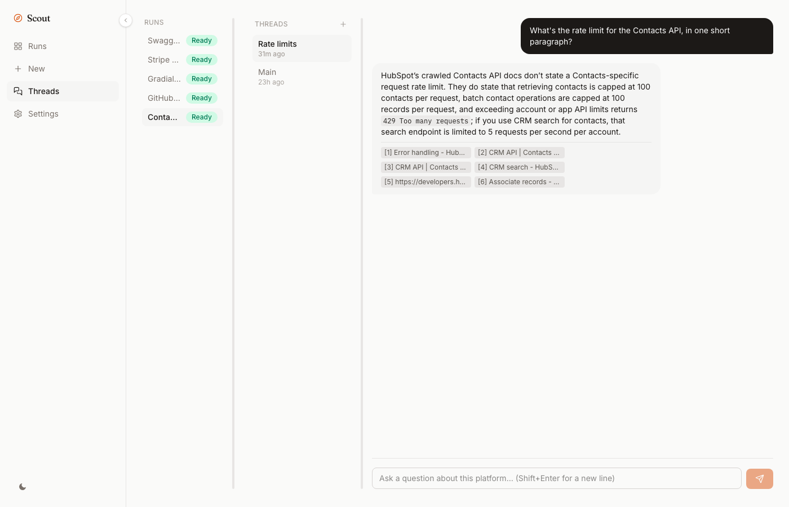
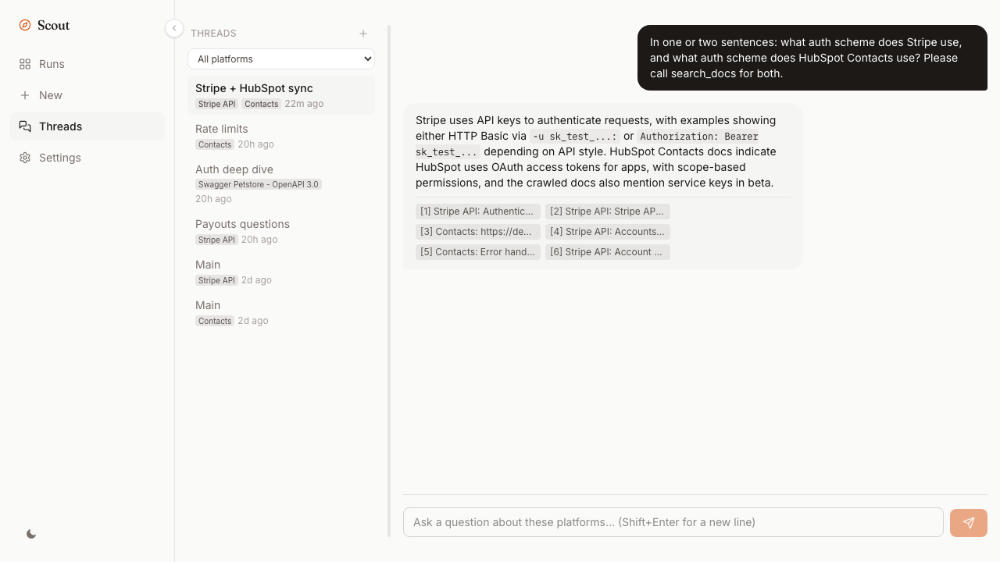
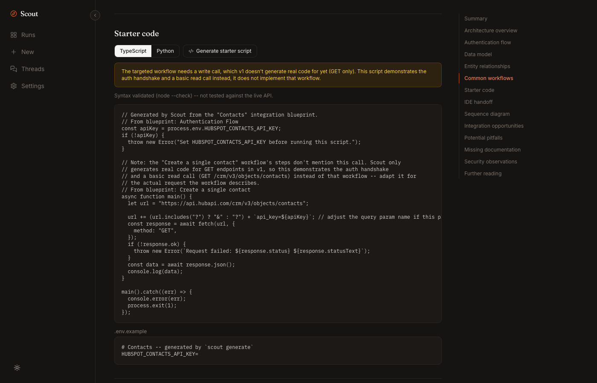
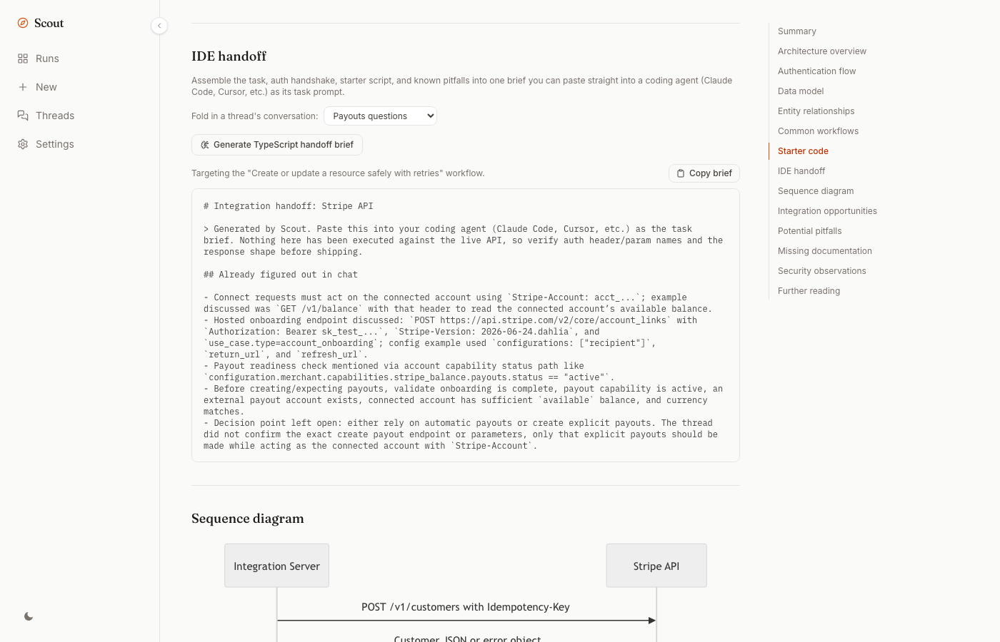

# Scout

[](https://github.com/prabhuavula7/scout/actions/workflows/ci.yml)
[](https://prabhuavula7.github.io/scout/)
[](LICENSE)

**[prabhuavula7.github.io/scout](https://prabhuavula7.github.io/scout/)** · **Point Scout at a platform's OpenAPI spec and docs. Get a cited, browsable integration blueprint and a real threaded chat assistant, in a local web app, in minutes.**

Scout is primarily a web app: `scout serve` opens it at `http://127.0.0.1`, no login, nothing leaves your machine. It also ships an equally capable CLI and an MCP server, so Claude Code, Cursor, Codex, and Gemini CLI can pull the same grounded understanding directly into their own context instead of guessing at a platform's API shape from training data.

Everything runs locally. No account, no hosted backend, no telemetry.

```
npm install -g @dotapk7/scoutcli
```

## Two minutes to a grounded blueprint

```
scout config llm add openai --api-key sk-...
scout understand https://petstore3.swagger.io/api/v3/openapi.json --docs https://example.com/docs
scout serve
```

That opens the web app: a sidebar with Runs, New, Threads, and Settings, a Settings tab if you'd rather add your provider key there than on the command line. Prefer a terminal? `scout chat <slug>` and `scout mcp` give the CLI and any MCP-speaking coding agent the exact same capabilities.


## The problem

You open a platform's docs to build an integration. Forty tabs in, you still don't know how auth actually works, what the core objects are, or which of six similarly-named endpoints does what you need. You paste a docs URL into Claude Code and ask it to wire up the integration. It writes confident code against an endpoint that doesn't exist, because it's pattern-matching against every payments API it saw in training, not reading this platform's actual docs.

That gap, between what a coding agent assumes and what a platform's docs actually say, is where integrations break. Scout closes it. It reads the OpenAPI spec as ground truth for what the API can do, crawls the docs as ground truth for how it's meant to be used, and cross-checks one against the other. When something isn't evidenced in either, it says so instead of inventing it.

## What you get

- **Understand Stripe, HubSpot, or any OpenAPI-documented platform in minutes**, not the first afternoon of a new integration.
- **A real chat, with real threads**, Claude/ChatGPT-style: multiple named conversations per platform, not one chat box you have to scroll past to start over.
- **Ask questions and get cited answers**, never an invented endpoint or field.
- **Get a real, syntax-checked starter script**, the auth handshake plus one working call, not pseudocode.
- **Hand your coding agent a paste-ready integration brief**, task, auth, starter code, known pitfalls, and (if you point it at one) an LLM-distilled summary of what you already figured out in a chat thread.
- **Give any MCP-speaking coding agent the same grounded understanding** through `scout mcp`, mid-session, no copy-pasting docs into a chat window.
- **Know the moment a platform's docs change** instead of finding out in production.

## Threads: a real chat, not a single Q&A box

Chat isn't one conversation per run. The Threads tab is a flat, Claude/ChatGPT-style thread list across every platform you've imported, not grouped by run first: start a new thread, rename it, delete it, switch back to an old one without losing context, filter down to one platform when you want to. Each thread shows a badge for every platform it's grounded in. The sidebar collapses to icon-only when you want the room, and the pane between the thread list and the conversation is draggable.

A thread isn't locked to one platform either, on any surface. Pick two or more when you create one in the web app, pass a comma-separated slug list to `scout chat`, or pass `slugs` (plus a `title` to name the conversation) to `ask_platform`, and the conversation is grounded in all of them at once: search_docs merges and re-ranks results across every platform's crawled docs, and every citation is tagged with which platform it actually came from, so "how would Stripe and HubSpot talk to each other" gets a real, cited answer instead of two separate single-platform conversations you have to reconcile yourself.

It's a real multi-turn tool-calling loop underneath, not a wrapper around a single prompt: it can search the platform's own crawled docs, search the live web if you've configured a provider, generate starter code, or assemble an IDE handoff brief, mid-conversation. Every answer is tagged with where it actually came from: a doc excerpt with a real similarity score, a live web result with a URL, or the model's own general knowledge, flagged unverified rather than given a fake citation.





## A handoff that carries the whole conversation

`scout generate` turns a stored blueprint into a runnable starter script: the auth handshake plus one real, working call, syntax-checked before it's shown to you. When a platform's auth scheme isn't supported yet or the workflow needs a write call, you get a clearly labeled stub and a reason, never fabricated-looking code that quietly does the wrong thing.



`scout handoff` goes one step further: it assembles the task, the auth flow, the starter script, the `.env.example`, and the real pitfalls Scout's synthesis flagged into one Markdown brief you can paste straight into a coding agent as its task prompt, or `--copy` it straight to your clipboard. Point it at a thread (`--thread <name>` on the CLI, a dropdown in the web app, `thread` on the MCP tool) and it folds an LLM-distilled summary of what was actually confirmed in that conversation into the brief, so the next agent that picks up the task doesn't have to re-derive what you already worked out in chat.



Full reference, including the exact auth schemes supported today: [docs/generated-code.md](docs/generated-code.md).

## Bring your own docs

Crawled `--docs` URLs aren't the only way to ground chat and handoffs. Attach a local file (PDF, docx/xlsx/pptx, odt/odp/ods, rtf, csv, md, html, txt, json, yaml, up to 10 MB) or a link directly from the Understanding page, `scout docs add <slug> <file-or-url>`, or the `attach_document_platform` MCP tool -- a runbook, a contract, an internal spec, an article -- and it's chunked, embedded, and cited exactly like a crawled doc page. Google Drive share links are refused with a clear reason (they resolve to a viewer page, not the file) rather than silently ingesting the wrong thing.

## Every endpoint, at a glance

The API Explorer lists every endpoint the spec declares, method-color-coded, searchable, no scrolling through YAML.


## The full understanding, cited

Architecture, auth flow, data model, entity relationships (rendered as a real diagram), common workflows, pitfalls, security observations, gaps Scout couldn't verify: all generated from the spec and docs you pointed it at, not from a generic template.


## AI agents get it too

`scout mcp` runs a standard stdio MCP server. Add it once and Claude Code, Claude Desktop, Cursor, Codex CLI, and Gemini CLI can all call Scout directly, mid-task, instead of guessing.

**Claude Code**
```
claude mcp add scout -- scout mcp
```

**Claude Desktop** (`claude_desktop_config.json`), **Cursor** (`.cursor/mcp.json`)
```json
{ "mcpServers": { "scout": { "command": "scout", "args": ["mcp"] } } }
```

**Codex CLI** (`~/.codex/config.toml`)
```toml
[mcp_servers.scout]
command = "scout"
args = ["mcp"]
```

**Gemini CLI** (`~/.gemini/settings.json`)
```json
{ "mcpServers": { "scout": { "command": "scout", "args": ["mcp"] } } }
```

Twelve tools, the same capabilities as the CLI and web app: import a spec, ask a grounded question in a named thread, refresh a stale run, check what changed, generate a starter script, assemble an IDE handoff brief (with or without a thread folded in), attach a local file or link to a run's doc corpus, export the blueprint, find further reading, clean up. A developer working in Claude Code can say "integrate Stripe invoicing" and the agent pulls real, cited platform knowledge into its own context instead of hallucinating an API shape. Full reference: [docs/mcp.md](docs/mcp.md).

## Real examples

Three platforms verified end-to-end against their real, public specs and docs:

| Platform | Command | What Scout found |
|---|---|---|
| **Stripe** | `scout understand https://raw.githubusercontent.com/stripe/openapi/master/openapi/spec3.json --docs https://docs.stripe.com` | Auth is HTTP Basic, not Bearer, real templates don't cover it yet, so `scout generate` correctly stubs instead of guessing. |
| **HubSpot** (Contacts) | `scout understand <hubspot-openapi-url> --docs https://developers.hubspot.com/docs/api/crm/contacts` | Real, syntax-validated TypeScript for the `api_key_query` auth scheme, plus 25+ real pitfalls (batch limits, idempotency, lifecycle-stage ordering) pulled straight from the docs. |
| **GitHub** (REST API) | `scout understand https://raw.githubusercontent.com/github/rest-api-description/main/descriptions/api.github.com/api.github.com.json --docs https://docs.github.com/en/rest` | Correctly identified `none`-scheme public endpoints vs. token-gated ones, and generated an honest stub rather than assuming a default. |

More platforms, full transcripts, and a walkthrough of the honesty behavior: [docs/examples.md](docs/examples.md).

## Core commands

| Command | What it does |
|---|---|
| `scout serve` | The local web app: Runs, New, Threads, API Explorer, Settings. |
| `scout understand <spec-url-or-path>` | Import a spec, crawl `--docs`, generate the understanding. |
| `scout chat <slug\|slug1,slug2,...> [--thread <name>]` | Agentic terminal chat: real tool-calling, cited answers, real threads. Comma-separated slugs chat across several platforms at once. |
| `scout generate <slug> --lang ts\|py` | A real, syntax-checked starter script, or an honest stub. |
| `scout handoff <slug> --lang ts\|py [--thread <name>] [--copy]` | A paste-ready integration brief, optionally folding a thread's findings in. |
| `scout diff <slug>` | Drift detection: what changed in a run's understanding since its last refresh. |
| `scout refresh <slug> [--recrawl]` | Regenerate the understanding without a full re-import. |
| `scout watch <slug>` | Poll a run's docs and refresh automatically when they change. |
| `scout export <slug> --format md\|json` | Export the blueprint. |
| `scout docs add <slug> <file-or-url>` | Attach a local file or a link to a run's grounded doc corpus, beyond its crawled docs. |
| `scout mcp` | Run Scout as an MCP server for coding agents. |

Full option list on any command: `scout <command> --help`. Everything else, providers, connectors, Docker, architecture, contributing: [docs/](docs/).

## Documentation

- **[prabhuavula7.github.io/scout](https://prabhuavula7.github.io/scout/)**, the same reference below as a browsable site.
- [Quickstart](docs/quickstart.md), five minutes from install to a grounded chat.
- [Why Scout exists](docs/why-scout.md), the honesty model and why OpenAPI plus docs beats either alone.
- [MCP reference](docs/mcp.md), all eleven tools, every agent's config format.
- [Generated code](docs/generated-code.md), `scout generate` and `scout handoff` in depth.
- [Examples](docs/examples.md), real runs against Stripe, HubSpot, GitHub, and more.
- [Connectors](docs/connectors.md), adding a platform preset.
- [Architecture](docs/architecture.md), package layout and the storage model.
- [Docker](docs/docker.md), running Scout with no local Node install.
- [Development](docs/development.md), building and testing from source.
- [FAQ](docs/faq.md).

See [CHANGELOG.md](CHANGELOG.md) for release notes and [ROADMAP.md](ROADMAP.md) for what's done vs. still open.

## License

MIT, see [LICENSE](LICENSE).
