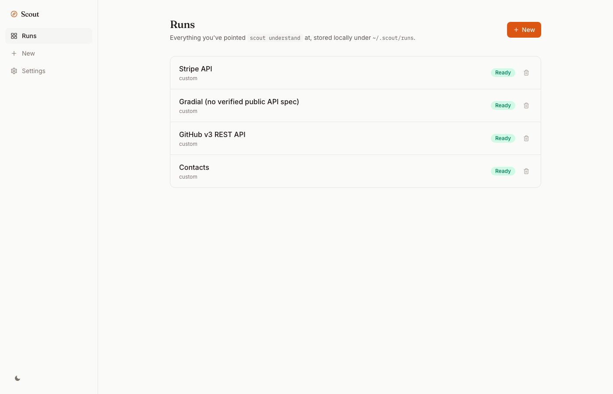
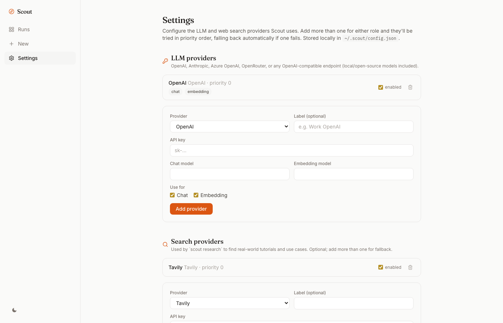

# Quickstart

Five minutes, install to a grounded chat.

## 1. Install

```
npm install -g @dotapk7/scoutcli
```

Requires Node 22+. No account, no API server to sign up for, no telemetry.

## 2. Add an LLM provider

Scout needs an LLM for synthesis and chat, and an embeddings model for search. One command, either OpenAI, Anthropic, Azure OpenAI, OpenRouter, or any local/self-hosted model that speaks the OpenAI chat-completions protocol (Ollama, LM Studio, vLLM):

```
scout config llm add openai --api-key sk-...
```

```
scout config llm add anthropic --api-key sk-ant-...
scout config llm add azure-openai --base-url https://your-resource.openai.azure.com --api-key ... --chat-model gpt-4o
scout config llm add openai-compatible --base-url http://localhost:11434/v1 --api-key ollama --chat-model llama3.1
```

Anthropic has no embeddings API, so pair an Anthropic entry (`chat` role) with an OpenAI/Azure/compatible entry (`embedding` role) if you want Claude for synthesis and chat. `scout config llm list` shows what's configured; keys are never printed back.

If you skip this step entirely, Scout falls back to `OPENAI_API_KEY` in your environment, so a zero-setup `.env` workflow still works.

## 3. Point it at a platform

You need two things: the OpenAPI/Swagger spec (a URL or local file), and, optionally, doc pages to crawl for grounded chat.

```
scout understand https://petstore3.swagger.io/api/v3/openapi.json --docs https://example.com/docs
```

Scout prints a size estimate first, imports the spec, crawls the docs (following same-site links up to `--docs-depth` hops, default 2, capped at `--docs-max-pages`, default 50), then synthesizes the understanding: architecture, auth flow, data model, entity relationships, common workflows, pitfalls, security observations. Real specs (Stripe, HubSpot, GitHub) take a minute or two depending on doc size; the Petstore demo spec above is fast.

## 4. Use it

```
scout chat petstore-openapi-3-0
```

Ask a real question. The agentic chat will search the crawled docs (and the live web, if you've configured a search provider), cite what it finds, and tell you plainly when something isn't in the docs instead of guessing.

```
scout generate petstore-openapi-3-0 --lang ts
scout handoff petstore-openapi-3-0 --lang ts --copy
```

`generate` gives you a real, syntax-checked starter script. `handoff` bundles that script with the task, auth flow, and known pitfalls into one brief, `--copy` puts it straight on your clipboard, ready to paste into Claude Code, Cursor, or whichever coding agent you're using.

Prefer a browser? `scout serve` opens the same thing at `http://127.0.0.1:4207` (127.0.0.1 only by default, no login) with a "New" tab that runs the same pipeline without touching the terminal again.





## 5. Wire it into your coding agent

```
claude mcp add scout -- scout mcp
```

See [mcp.md](mcp.md) for Claude Desktop, Cursor, Codex CLI, and Gemini CLI. Once it's added, your coding agent can call Scout directly, mid-task, instead of guessing at the platform's API shape.

## Keep it current

```
scout watch petstore-openapi-3-0
```

Polls the run's doc URLs, re-synthesizes automatically when they change, and archives the previous snapshot so `scout diff` can show you exactly what changed.

## Next

- [Why Scout exists](why-scout.md), the honesty model behind every answer.
- [Real examples](examples.md) against Stripe, HubSpot, and GitHub.
- [Docker](docker.md) if you'd rather not install Node at all.
